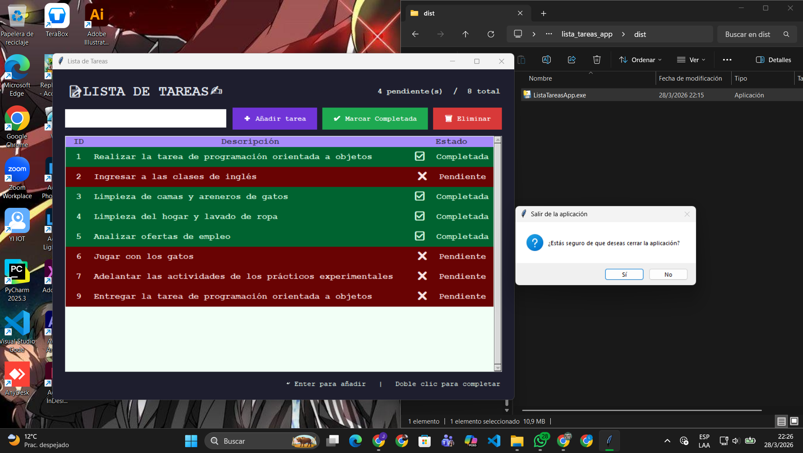

# 📝Aplicación GUI Lista de Tareas ✍️ con Eventos y Ejecutable

Aplicación de escritorio tipo *To-Do List* desarrollada con *Python + Tkinter*, aplicando:

- Programación Orientada a Objetos (POO)
- Arquitectura modular por capas (Modelo → Servicio → UI → main)
- Manejo de eventos de usuario (teclado y ratón)

---

## 🎯 Objetivo del Proyecto

Desarrollar una aplicación interactiva que permita gestionar tareas diarias, cumpliendo con:

- Separación de responsabilidades por capas  
- Interfaz gráfica funcional y reactiva  
- Manejo de eventos con .bind()  
- Feedback visual claro del estado de las tareas  
- Generación de ejecutable con PyInstaller  

---

## 📁 Estructura del proyecto

```
S15-POO-TareasGUI--Sigcha-Joselyn/ lista_tareas_app/
│
├── modelos/
│   └── tarea.py             # Clase Tarea (id, descripcion, estado_completado)
├── servicios/
│   └── tarea_servicio.py    # Lógica: agregar, completar, eliminar, listar
└── ui/
│    └── app_tkinter.py      # Interfaz Tkinter + captura de eventos
│
├── main.py                  # Orquestador y punto de arranque
│
├── dist/                    # Ejecutable (.exe)
├── README.md                # Documentación del proyecto
└── .gitignore               # Archivos y carpetas que Git debe ignorar
```
## 📦 Arquitectura por capas

### 📌 Modelos

Define la entidad Tarea.

✔️ Incluye:
- id  
- descripción  
- estado (completada o no)  

✔️ Implementa:
- Encapsulación  
- Properties (@property)  
- Validación de datos  

---

### ⚙️ Servicios

Contiene la lógica del sistema.

✔️ Funcionalidades:
- Agregar tareas  
- Marcar tareas como completadas  
- Eliminar tareas  
- Listar tareas  

✔️ Incluye:
- Validación de descripción vacía  
- Manejo de errores con excepciones  

---

### 🖥️ Interfaz Gráfica (UI)

Desarrollada con *Tkinter*.

✔️ Permite:
- Ingresar tareas  
- Visualizar tareas en Treeview  
- Seleccionar tareas  
- Ejecutar acciones mediante botones  

✔️ Componentes usados:
- Entry  
- Button  
- ttk.Treeview  
- messagebox  

---

## 🎮 Funcionalidades

| Acción | Método |
|---|---|
| Añadir tarea | Botón **＋ Añadir** |
| Añadir tarea rápido | Tecla **Enter** en el campo de texto|
| Marcar completada | Botón **✔ Marcar Completada** |
| Marcar completada rápido | **Doble clic** sobre la tarea en la lista|
| Eliminar tarea | Botón **🗑 Eliminar** (con confirmación) |

---

## 🎨 Feedback Visual

- 🔴 *Pendiente*
  - Texto rosa pastel 
  - Fondo rojizo oscuro  
  - Estado: ✗ Pendiente  

- 🟢 *Completada*
  - Texto verde pastel  
  - Fondo verdoso oscuro  
  - Estado: ✔ Completada  

- El contador en el encabezado muestra `X pendiente(s) / Y total`.
- Además existe un apartado de indicaciones sobre las acciones rápidas para el usuario.

>✔️ Permite identificar el estado visualmente de forma clara.

---

## 👨‍💻 Eventos implementados con `.bind()`

```python
# Evento de teclado (Enter)
self._entry_tarea.bind("<Return>", self._on_enter)

# Evento de ratón (doble clic)
self._tree.bind("<Double-1>", self._doble_click)

```
> ✔️ Cumple con los requisitos de eventos avanzados.

---

## 📋 Requisitos

- Python 3.10 o superior  
- Tkinter (incluido en Python)

## 🚀 Cómo Ejecutar el Programa en consola

1. **Obtener el enlace del repositorio.**
2. **Abrir un IDE:** PyCharm o Visual Studio Code.
3. **Clonar el repositorio:**
   ```bash
   git clone <url-del-repositorio>
   ```
4. **Ejecutar:**
   ```bash
   python main.py
   ```
5. Se abrirá la interfaz gráfica del sistema de tareas.

---

## 📦 Ejecutable con PyInstaller

```bash

1. pip install pyinstaller
2. cd lista_tareas_app
3. pyinstaller --noconsole --onefile --name ListaTareasApp main.py


📁 Ubicación del ejecutable:


S15-POO-TareasGUI--Sigcha-Joselyn/ lista_tareas_app/ dist/ListaTareasApp.exe

```
> **Nota**: La carpeta `build/` y el archivo `.spec` son generados
> automáticamente y están excluidos del repositorio via `.gitignore`.


## 📝Aplicación ejecutada:



---

## 🧠 Buenas prácticas aplicadas

- ✔️ Programación Orientada a Objetos (POO)  
- ✔️ Encapsulación  
- ✔️ Separación por capas  
- ✔️ Inyección de dependencias  
- ✔️ Manejo de eventos  
- ✔️ Código modular  
- ✔️ Uso de ttk.Treeview con estilos  

---

## 🏁 Conclusión

Este proyecto implementa una aplicación GUI completa en Python, integrando:

- Arquitectura limpia  
- Interacción dinámica  
- Eventos de teclado y ratón  
- Feedback visual claro  

Además, el uso de PyInstaller permite distribuir la aplicación como ejecutable funcional.